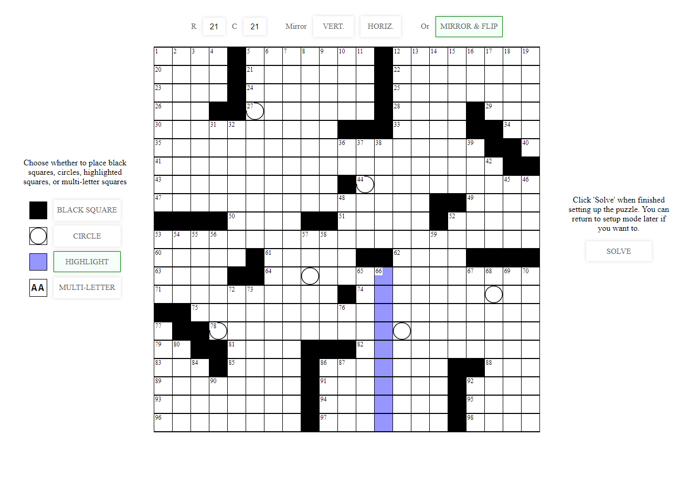

## Web-browser crossword editing / solving tool

This is a tool for editing / solving crosswords in a web-browser. I have some relatives who like to work on crossword puzzles together over video call - I made this for them to make it easier to keep the puzzle synced across the call.

Live at [crossword.gloudemans.fun](https://crossword.gloudemans.fun)

Currently it's just a simple static website hosted using GitHub Pages. Originally had planned to allow collaborative editing but may or may not come back to that.

